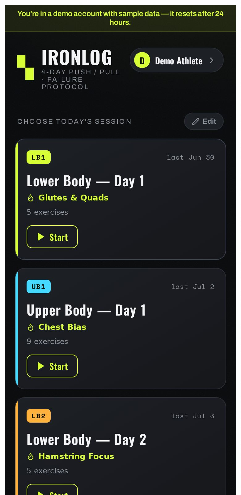
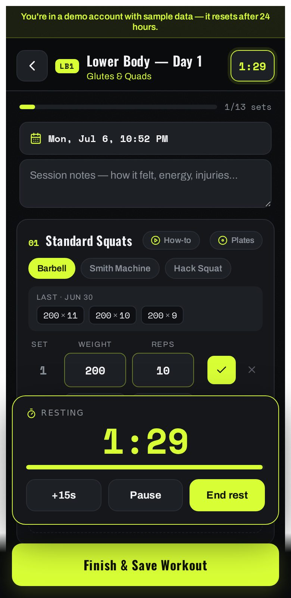
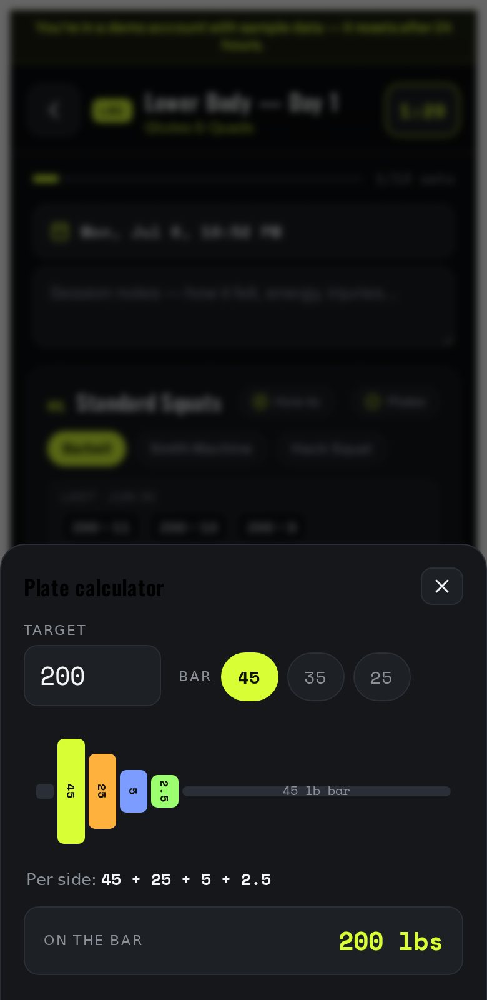
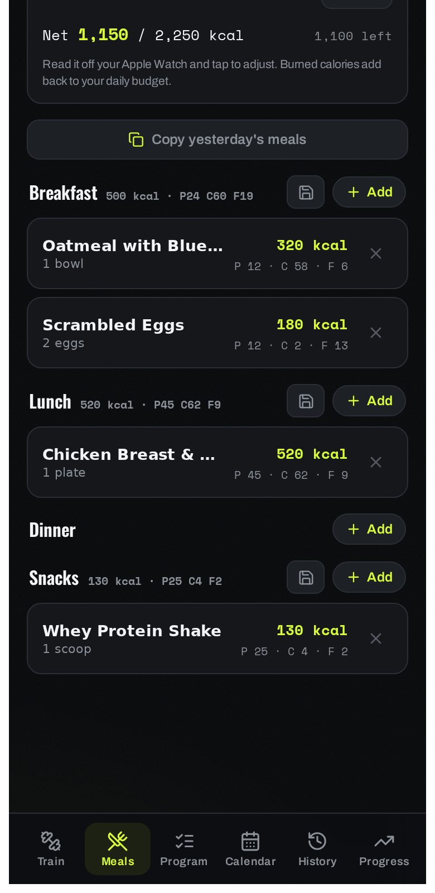
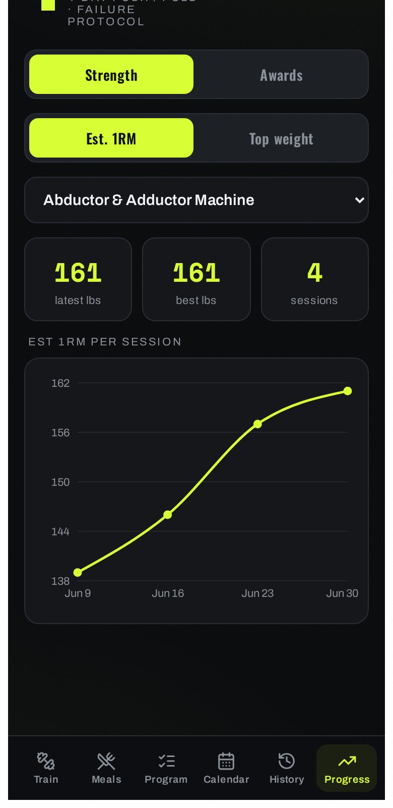

# IRONLOG

Your gym and your kitchen, in one app. IRONLOG is a full-stack **workout + nutrition
tracker**: log sets with a rest timer and PR detection, track calories and macros with
barcode scanning, and watch your strength and body weight trend — synced across devices,
installable as a PWA.

**Live:** <https://lokoto-ironlog.fly.dev> — or hit **"Try the demo — no sign-in"** on the
landing page for a throwaway account pre-loaded with a month of realistic training data
(it resets after 24 hours). No Google account needed.

<p align="center">
  
  
  
  
  
</p>

Deployed on Fly.io with continuous backups and CI/CD. MIT-licensed ([LICENSE](LICENSE)).

### Features

- **Auth** — Google Sign-In (GIS/FedCM); the server verifies the ID token and issues its own httpOnly session cookie.
- **Onboarding** — a 2-step wizard: body stats + goal (auto-computes macro targets), then choose the default 4-day split or build a custom program. Re-runnable from Profile.
- **Workouts** — editable per-user programs, set logging, rest timer (auto-rest, sound/vibrate), PR detection, estimated 1RM, a per-exercise **plate calculator**, calendar + history, per-lift strength trend charts.
- **Demo mode** — one tap creates a throwaway account seeded with a program, a month of progressing workout history, body-weight entries and today's meals; purged automatically after 24h.
- **Exercise guides** — in-app form instructions + demo images (public-domain free-exercise-db), with a video-search fallback.
- **Nutrition** — daily calories/macros vs auto-targets, grouped into **Breakfast/Lunch/Dinner/Snacks**; food **search** + **barcode lookup/scan** (Open Food Facts + USDA); servings or grams; **recent/favorites**, **saved meals (recipes)**, **copy-day**, and **edit/rescale** any entry.
- **Body** — weight log + trend chart; goal-driven Mifflin–St Jeor macro targets.
- **Sharing/growth** — marketing **landing page** for logged-out visitors; **shareable workout card** (canvas → native share/PNG).
- **Account** — data export (JSON) and account deletion.
- **PWA** — installable, offline app shell, themed; **in-app auto-update** banner on new deploys.

### Stack

- **Frontend:** Vite + React (`src/workout-tracker.jsx` is the whole UI), `lucide-react`, `recharts` (lazy), `@zxing/browser` (lazy, iOS barcode fallback)
- **Backend:** Node + Express (`server/app.js` builds the app; `server/index.js` listens), with `helmet` + `express-rate-limit`, request validation via `zod`
- **Database:** SQLite via `better-sqlite3` — all SQL isolated in `server/db.js` (Postgres-swappable)
- **Tests:** Node's built-in runner + `supertest` (`npm test`) · **CI/CD:** GitHub Actions runs tests/build and auto-deploys to Fly on push to `main`
- **Backups:** Litestream → Fly Tigris (continuous, point-in-time)

---

## 1. Project layout

```
.
├── index.html                 # loads the GIS script + the React app (+ PWA meta)
├── vite.config.js             # dev server proxying API routes to Express
├── package.json               # one package.json for frontend + backend
├── Dockerfile                 # prod image (installs Litestream); run via scripts/run.sh
├── fly.toml / litestream.yml  # Fly deploy + continuous backup config
├── .github/workflows/ci.yml   # CI/CD: test + build + auto-deploy on push to main
├── scripts/
│   ├── run.sh                 # entrypoint: app under Litestream (or directly)
│   └── generate-icons.mjs     # generates the PWA icons
├── public/                    # manifest, service worker (sw.js), icons
├── docs/                      # VPS deployment guide, Windows cert troubleshooting
├── src/
│   ├── main.jsx               # React entrypoint (+ build-hash for auto-update)
│   ├── workout-tracker.jsx    # the main UI
│   ├── PlateCalc.jsx          # plate-calculator bottom sheet (live session)
│   ├── TrendChart.jsx         # lazy-loaded recharts chart
│   ├── api.js                 # fetch wrapper (with retries)
│   └── lib/
│       └── stats.js(.test.js) # pure training math: e1rm, PRs, plate loading
├── server/
│   ├── app.js                 # builds the Express app (importable for tests)
│   ├── index.js               # starts the HTTP listener
│   ├── auth.js                # GIS verify, session cookie, requireAuth, export/delete
│   ├── demo.js                # demo accounts: create + seed + 24h purge
│   ├── validation.js          # zod schema for workout payloads
│   ├── workouts.js · programs.js · profile.js · meals.js · weights.js
│   ├── foods.js               # food search/barcode proxy (OFF + USDA)
│   ├── exercises.js(.json)    # exercise form-guide lookup + slimmed dataset
│   ├── defaultProgram.js      # the default 4-day split (onboarding seed)
│   ├── db.js                  # the ONLY file with SQL — swap this for Postgres
│   └── *.test.js              # backend tests
└── data/                      # SQLite file lives here (git-ignored)
```

---

## 2. Create your Google OAuth Web client ID

1. Go to the **Google Cloud Console → APIs & Services → Credentials**:
   <https://console.cloud.google.com/apis/credentials>
2. Pick (or create) a project.
3. If prompted, configure the **OAuth consent screen**:
   - User type **External**, fill in app name + your email.
   - While testing, add your Google account under **Test users** (or publish the app).
   - Scopes: the default `openid`, `email`, `profile` are all you need.
4. Click **Create Credentials → OAuth client ID**.
5. Application type: **Web application**.
6. Fill in the two lists below, then click **Create**. Copy the **Client ID** it gives you.

### Authorized JavaScript origins

These are the origins the sign-in button is allowed to run on. **No paths, no trailing slash.**

| Environment | Value |
|-------------|-------|
| Local dev   | `http://localhost:5173` |
| Production  | `https://YOURDOMAIN`  ← **fill in your real domain** |

### Authorized redirect URIs

GIS with FedCM uses the JavaScript origins above and does **not** require a redirect
URI for this token flow. You can leave **Authorized redirect URIs empty**.
(If the console insists on at least one, add `https://YOURDOMAIN` — it won't be used.)

> **`YOURDOMAIN` is a placeholder.** Replace it everywhere with the real domain you'll
> deploy to (e.g. `workouts.example.com`). It appears here and is the only thing Google
> ties the sign-in button to.

---

## 3. Configure environment variables

```bash
cp .env.example .env
```

Then edit `.env`:

| Variable | What to put |
|----------|-------------|
| `GOOGLE_CLIENT_ID` | The Client ID from step 2 (backend verifies tokens against it) |
| `VITE_GOOGLE_CLIENT_ID` | **The same** Client ID (frontend renders the button with it) |
| `SESSION_SECRET` | A long random string. Generate one: `node -e "console.log(require('crypto').randomBytes(48).toString('hex'))"` |
| `PORT` | API port (default `8080`) |

**Values YOU must fill in:**
1. `GOOGLE_CLIENT_ID` **and** `VITE_GOOGLE_CLIENT_ID` → your real Google client ID.
2. `SESSION_SECRET` → your generated secret.
3. `YOURDOMAIN` in this README / the Google console → your real domain (only needed for production).

---

## 4. Run in development

```bash
npm install
npm run dev
```

- Vite dev server: <http://localhost:5173>  ← **open this**
- Express API: <http://localhost:8080> (Vite proxies `/auth` and `/workouts` to it)

Because everything is served through `localhost:5173`, the session cookie is first-party
and there's no CORS to deal with. Sign in with the Google account you added as a test user.

> The cookie is sent without the `Secure` flag in dev (plain `http://localhost`), and with
> `Secure` automatically in production.

---

## 5. Build & run in production (single origin)

```bash
npm run build     # outputs dist/
npm start         # NODE_ENV=production; Express serves dist/ AND the API on $PORT
```

Now the whole app — frontend and API — is served from one origin on `PORT`, so cookies
stay first-party. Put a reverse proxy with HTTPS in front of it (next section).

---

## 6. Deploy on a VPS

The live app runs on Fly.io (next section), but self-hosting is a first-class option:
a minimal, robust **Node app behind Nginx (or Caddy) with HTTPS**. The full walkthrough
(PM2, reverse proxy, certificates, Google console checklist) lives in
**[docs/vps-deploy.md](docs/vps-deploy.md)**.

---

## 7. npm scripts

| Script | Does |
|--------|------|
| `npm run dev` | Express (`:8080`) + Vite (`:5173`) together, with API proxy + hot reload |
| `npm run build` | Builds the frontend to `dist/` |
| `npm start` | Production: Express serves `dist/` and the API on `$PORT` |
| `npm run preview` | Vite's static preview of `dist/` (no backend) |
| `npm test` | Run the backend test suite (Node's built-in runner + supertest, in-memory DB) |
| `npm run deploy` | `fly deploy --depot=false` (manual deploy; CI also deploys on push) |

### Deploy: Fly.io + CI/CD (the live setup)

The app runs on **Fly.io** (single always-on machine + a persistent volume for SQLite,
Litestream backups). Pushing to `main` triggers **GitHub Actions**
([.github/workflows/ci.yml](.github/workflows/ci.yml)) which runs `npm test` + `npm run
build`, then **auto-deploys** with `flyctl deploy` using a `FLY_API_TOKEN` repo secret. So
**`git push` = ship** (only if tests pass). The client polls `/api/version` and shows an
in-app "update available" banner when a new build is live. The VPS instructions above are a
self-host alternative.

---

## 8. API reference

All workout routes require the session cookie (set after `POST /auth/google`).

| Method & path | Body | Returns |
|---------------|------|---------|
| `POST /auth/google` | `{ credential }` (GIS ID token) | `{ user }` + sets cookie |
| `POST /auth/demo` | – | `{ user }` (with `demo:true`) + sets cookie — creates a throwaway pre-seeded account; demo accounts >24h old are purged on each call. Shares `/auth/google`'s rate limit. |
| `POST /auth/logout` | – | `{ ok: true }`, clears cookie |
| `GET /auth/me` | – | `{ user }` or `401` |
| `GET /auth/export` | – | full JSON export of all the user's data |
| `DELETE /auth/account` | – | deletes the account + all data (cascade), clears cookie |
| `GET /workouts` | – | array of sessions, newest first. Optional `?limit=1..500&offset=` returns one page; `X-Total-Count` header always carries the total |
| `POST /workouts` | a session object | `{ workout }` — payload validated with zod (unknown keys stripped, sizes bounded); `400` with a field-level message on failure |
| `DELETE /workouts/:id` | – | `{ ok: true }` (only your own) |
| `POST /workouts/import` | `{ sessions: [...] }` | `{ added, skipped, total }` (merge, never wipe; invalid rows are skipped, not fatal) |
| `GET /program` | – | `{ days, onboarded }` (no auto-seed; `onboarded:false` for new users) |
| `PUT /program` | `{ days: [...] }` | `{ days }` (save the user's edited program) |
| `POST /program/reset` | – | `{ days }` (restore the default program) |
| `DELETE /program` | – | clears the program → re-run onboarding (keeps history/profile) |
| `GET /profile` · `PUT /profile` | profile obj | body stats, goal, macro targets (`null` if unset) |
| `GET /weights` · `POST /weights` · `DELETE /weights/:id` | `{ day, weightLbs }` | body-weight log for the trend chart |
| `GET /meals?date=YYYY-MM-DD` | – | array of food entries for that day (with `slot`) |
| `POST /meals` | `{ day, slot, name, amount?, grams?, base?, calories, protein, carbs, fat }` | `{ meal }` |
| `PUT /meals/:id` | `{ amount?, grams?, calories, ... }` | `{ meal }` (edit/rescale an entry) |
| `DELETE /meals/:id` | – | `{ ok: true }` |
| `POST /meals/bulk` | `{ day, items:[...] }` | the day's meals (log many at once) |
| `POST /meals/copy` | `{ from, to }` | copies a day's entries to another day |
| `GET /meals/recent` · `GET/POST /meals/favorites` · `DELETE /meals/favorites/:id` | – | recents & favorites |
| `GET/POST /meals/recipes` · `DELETE /meals/recipes/:id` | `{ name, items }` | saved meals |
| `GET /foods/search?q=` | – | `{ results }` (Open Food Facts → USDA fallback) |
| `GET /foods/barcode/:code` | – | `{ result }` single product by barcode, or `404` |
| `GET /exercises/lookup?name=&variation=` | – | `{ match }` form guide, or `null` |
| `GET /api/health` · `GET /api/version` | – | health check · deployed bundle hash (auto-update) |

Exercise guides come from the public-domain [free-exercise-db](https://github.com/yuhonas/free-exercise-db)
(slimmed into `server/exercises.json`; demo images served from jsDelivr). Matching uses
curated overrides for the default program plus a movement-class-guarded fuzzy matcher in
`server/exercises.js`, so a "row" never resolves to a "press".

**Data model**

- `users`: `id, google_sub (unique), email, name, picture, created_at`
- `workouts`: `id, user_id, client_id, day_key, day_name, focus, tag, started_at, finished_at, exercises (JSON), created_at`
- `programs`: `user_id (unique), days (JSON), updated_at` — each user's editable program (default 4-day split is the onboarding seed; not auto-created).
- `profiles`: `user_id (unique), data (JSON: sex, age, heightIn, weightLbs, activity, goal, targets), updated_at` — drives macro targets (Mifflin–St Jeor; overridable).
- `meals`: `id, user_id, day, slot (breakfast/lunch/dinner/snacks), name, brand, amount, grams, base (JSON per-100g), calories, protein, carbs, fat, created_at` — per-day food log. `slot/grams/base` added via a startup migration in `db.js`.
- `favorites`: `id, user_id, name, brand, amount, macros…` — starred foods.
- `recipes`: `id, user_id, name, items (JSON array of food entries), created_at` — saved meals.
- `weights`: `id, user_id, day (unique per user), weight_lbs, created_at` — body-weight log.

Food search/barcode is proxied through `server/foods.js`. It tries **Open Food Facts**
first (keyless **search-a-licious** API at `search.openfoodfacts.org` — the legacy
`cgi/search.pl` endpoint 503s datacenter IPs, so don't use it server-side), then falls back
to **USDA FoodData Central** when OFF has no match (far better coverage of US branded
groceries, incl. barcodes).

USDA uses `FOOD_API_KEY`; without it, it falls back to the rate-limited `DEMO_KEY`
(~30 requests/hour). Get a free key at <https://fdc.nal.usda.gov/api-key-signup.html> and
set it as a secret: `fly secrets set FOOD_API_KEY=...` (and add `FOOD_API_KEY=` to `.env`
for local dev).

> **Reliability note:** [fly.toml](fly.toml) keeps the machine always-on
> (`auto_stop_machines = "off"`, `min_machines_running = 1`) so saves never hit a cold
> start. Set autostop back to `"suspend"` if you'd rather save money and rely on the
> client-side retries in `src/api.js`.

### Backups (Litestream → Fly Tigris)

The SQLite DB is continuously replicated to object storage by **Litestream** (config in
[litestream.yml](litestream.yml); the [Dockerfile](Dockerfile) installs it and the
[scripts/run.sh](scripts/run.sh) entrypoint runs the app under
`litestream replicate -exec`). On boot, if the volume DB is missing it auto-restores from
the replica. Retention is 7 days with daily snapshots.

Set up (already done for this app):
```bash
fly storage create -a <app> -n <bucket> -o personal -y   # provisions Tigris + secrets
# If run.sh logs "Litestream disabled" afterwards, the secrets didn't inject —
# re-set them explicitly to force it, then redeploy:
fly secrets set BUCKET_NAME=<bucket> AWS_ENDPOINT_URL_S3=https://fly.storage.tigris.dev \
  AWS_REGION=auto AWS_ACCESS_KEY_ID=<key> AWS_SECRET_ACCESS_KEY=<secret>
```
Manual restore to a file: `litestream restore -config /etc/litestream.yml /tmp/app.db`.
Check backups: `litestream snapshots -config /etc/litestream.yml /data/app.db`.

The `exercises` JSON matches the frontend shape exactly:
`[{ name, variation, variations[], sets: [{ w, r, done, doneAt, restBefore }] }]`.

---

## 9. Migrating off your old on-device data

The old version stored everything in the browser via `window.storage`. To carry that
history into your account, use the **Export backup** button on the old build (History tab)
to get a JSON file, then sign in here and use **Import** — it `POST`s to `/workouts/import`,
which merges by id without wiping anything.

---

## 10. Troubleshooting: `UNABLE_TO_VERIFY_LEAF_SIGNATURE` / cert errors

If `npm install` or Google sign-in fails with certificate errors on a Windows dev machine,
antivirus or a corporate proxy is intercepting HTTPS. The fix (export the OS trust store
to a PEM bundle + `NODE_EXTRA_CA_CERTS`, plus the flyctl/Depot variant) is documented in
**[docs/windows-cert-troubleshooting.md](docs/windows-cert-troubleshooting.md)**.

---

## 11. Swapping SQLite → Postgres later

Every SQL statement lives in `server/db.js`, behind these functions:
`findOrCreateUser`, `getUserById`, `listWorkouts`, `upsertWorkout`, `deleteWorkout`,
`importWorkouts`. Reimplement just those against `pg` (the `ON CONFLICT (user_id, client_id)`
upsert and JSON column both port directly to Postgres) and nothing else has to change.

---

## 12. License

[MIT](LICENSE).
